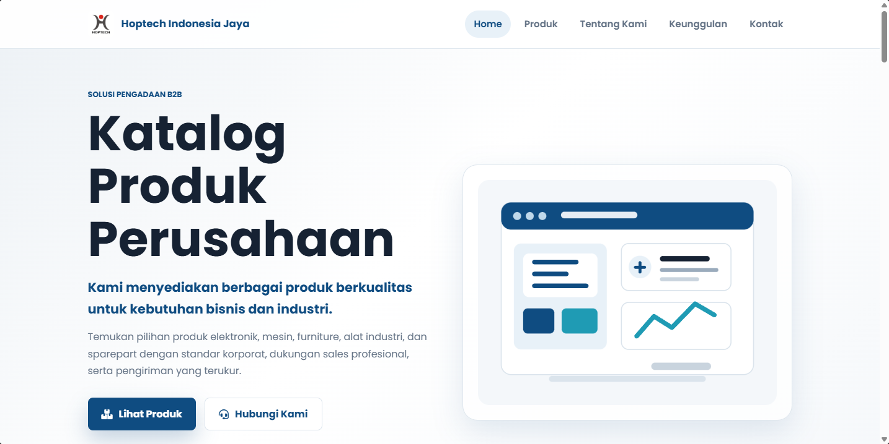

# 🏢 B2B Product Catalog Web App

Website katalog produk perusahaan B2B yang dibangun menggunakan **HTML5, CSS3, dan Vanilla JavaScript** tanpa framework. Aplikasi ini dirancang dengan tampilan modern, profesional, responsive, dan mudah dikembangkan menjadi website perusahaan atau e-commerce B2B.

---

## 🌐 Live Demo

> GitHub Pages:
> https://kingdhet12.github.io/kingdhet12/

> Repository:
> https://github.com/username/kingdhet12

---

## 📸 Preview

Tambahkan screenshot website ke folder `assets/images/preview.png`

```md

```

---

# ✨ Features

### 🎨 User Interface

- Modern Corporate Design
- Responsive Layout
- Mobile Friendly
- Desktop Friendly
- Tablet Friendly
- Smooth Animation
- Sticky Navigation
- Modern Card Layout
- Professional Color Palette
- Google Fonts (Poppins)
- Font Awesome Icons

---

### 🛍 Product Catalog

- Display Product Grid
- 12+ Sample Products
- Product Categories
- Product Images
- Product Detail Modal
- Product Specifications
- Contact Sales Button

---

### 🔎 Product Search

- Real-time Search
- Search by Product Name
- No Page Reload

---

### 🏷 Product Filter

- Electronics
- Machinery
- Furniture
- Industrial Equipment
- Spare Parts

Dynamic filtering using Vanilla JavaScript.

---

### 📄 Company Profile

- Company Overview
- Vision
- Mission

---

### ⭐ Company Advantages

Display 6 company advantages:

- High Quality Products
- Competitive Pricing
- Product Warranty
- Fast Delivery
- Professional Team
- Excellent Customer Service

---

### 📞 Contact

Contact Form

- Name
- Email
- Phone Number
- Message

Company Information

- Address
- Email
- WhatsApp
- Business Hours

---

### ⚡ Interactive Features

- Sticky Navbar
- Smooth Scrolling
- Active Navigation
- Product Search
- Category Filter
- Product Detail Modal
- Fade Animation
- Hover Effects
- Back To Top Button

---

# 📂 Project Structure

```
B2B-Product-Catalog/
│
├── index.html
├── style.css
├── script.js
├── README.md
│
└── assets/
    ├── images/
    │     ├── preview.png
    │     ├── product1.jpg
    │     ├── product2.jpg
    │     ├── product3.jpg
    │     └── ...
    │
    ├── icons/
    │
    └── logo/
          └── company-logo.png
```

---

# 🛠 Technologies Used

- HTML5
- CSS3
- Vanilla JavaScript
- Google Fonts
- Font Awesome

No Framework

No Bootstrap

No React

No Vue

No Backend

---

# 📑 Website Sections

## 🏠 Home

Hero banner dengan headline perusahaan.

Call To Action

- View Products
- Contact Us

---

## 📦 Product Catalog

Menampilkan daftar produk dalam bentuk grid.

Setiap produk berisi:

- Product Image
- Product Name
- Category
- Description
- Detail Button

---

## 🔍 Search

Realtime search menggunakan JavaScript.

---

## 🏷 Category Filter

Filter produk berdasarkan kategori tanpa reload halaman.

---

## 📄 Product Detail

Modal popup berisi:

- Product Image
- Product Name
- Category
- Description
- Specifications
- Contact Sales Button

---

## 🏢 About Company

Menampilkan:

- Company Profile
- Vision
- Mission

---

## ⭐ Advantages

Company Advantages dalam bentuk icon cards.

---

## 📞 Contact

Contact Form

Company Information

Google Maps (opsional)

WhatsApp

Email

Business Hours

---

## 📄 Footer

- Company Logo
- Navigation Menu
- Social Media
- Copyright

---

# 📱 Responsive Design

Optimized for

- Desktop
- Laptop
- Tablet
- Smartphone

---

# 💾 Product Data

Data produk disimpan menggunakan JavaScript Array.

Contoh struktur:

```javascript
{
    id: 1,
    nama: "Industrial Machine",
    kategori: "Mesin",
    harga: "Rp 15.000.000",
    gambar: "assets/images/product1.jpg",
    deskripsi: "Industrial machine description",
    spesifikasi: "Specification..."
}
```

---

# 🚀 Getting Started

Clone repository

```bash
git clone https://github.com/username/repository-name.git
```

Masuk ke folder project

```bash
cd repository-name
```

Jalankan website

Buka file

```
index.html
```

langsung menggunakan browser.

Tidak memerlukan:

- Database
- Server
- NodeJS
- NPM
- Build Process

---

# 🎯 Future Improvements

Beberapa fitur yang dapat ditambahkan:

- Admin Dashboard
- Login System
- Product Management
- Backend API
- Database Integration
- Shopping Cart
- Quotation Request
- WhatsApp API
- Product Comparison
- Dark Mode
- Multi Language
- SEO Optimization
- Google Analytics
- Product Pagination
- Lazy Loading Images

---

# 🤝 Contributing

Kontribusi sangat terbuka.

Langkah-langkah:

1. Fork repository
2. Buat branch baru

```bash
git checkout -b feature/new-feature
```

3. Commit perubahan

```bash
git commit -m "Add new feature"
```

4. Push branch

```bash
git push origin feature/new-feature
```

5. Buat Pull Request

---

# 📄 License

Project ini dibuat untuk kebutuhan pembelajaran, demonstrasi, dan portofolio.

Silakan digunakan dan dimodifikasi sesuai kebutuhan.

---

# 👨‍💻 Author

**Resa Erlangga**

📧 Email  
your@email.com

💼 LinkedIn  
https://linkedin.com/in/resaerlangga

🐙 GitHub  
https://github.com/kingdhet12

🌐 Portfolio  
https://kingdhet12.github.io/

---

## ⭐ Support

Jika project ini bermanfaat, jangan lupa berikan **Star ⭐** pada repository GitHub ini.

Semoga project ini dapat menjadi referensi untuk membangun website katalog produk perusahaan yang profesional.
